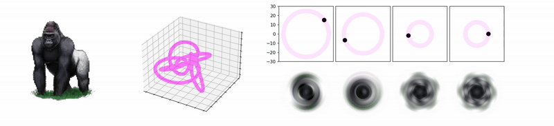
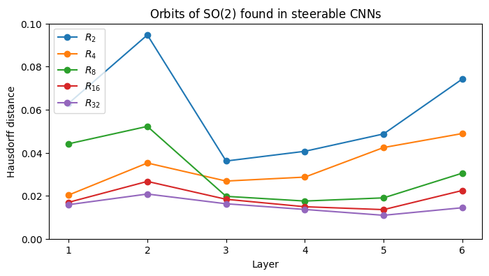

# LieDetect: Detection of representation orbits of compact Lie groups from point clouds

---

## Background

In this [arxiv preprint](https://arxiv.org/abs/2309.03086), we suggested a new algorithm to estimate representations of
compact Lie groups from finite samples of their orbits. The algorithm takes as an input a point cloud $X$ in 
$\mathbb{R}^n$, a compact Lie group $G$—among $\mathrm{SO}(2)$, $T^d$ for $d\geq 1$, $\mathrm{SO}(3)$, and 
$\mathrm{SU}(2)$—and returns a representation of $G$ in $\mathbb{R}^n$ and an orbit $\mathcal{O}$ that, if succeeded, 
lies close to $X$.

At its core, the algorithm enumerates the representations of the group in $\mathbb{R}^n$, up to orbit-equivalence, and
determines the best one, at the level of Lie algebras, and through an optimization over the orthogonal
group $\mathrm{O}(n)$. The following animation illustrates the case of a representation of $\mathrm{SO}(2)$
in $\mathbb{R}^{12}$. Similar illustrations are
found [here](https://www.youtube.com/playlist?list=PL_FkltNTtklBQlwrGyAnisJ-lGiLFeTVw).


All the illustrations found in our paper are implemented in `notebooks/illustrations.ipynb`. In addition, this repo
contains several other notebooks, described below.

For a general presentation of this work, see the talks [in English](https://www.youtube.com/watch?v=XnXcgRlafZw) or 
[in Portuguese](https://www.youtube.com/watch?v=AbpG5XuFb7c).

## Tutorial

Basic experiments are found in `notebooks/tutorial.ipynb`, displaying the possibilities of $\texttt{LieDetect}$. A 
typical example is given below.

```python
# Local imports.
from algebra import are_representations_equivalent
from orbits import sample_orbit_from_group, sample_orbit_from_algebra, print_hausdorff_distance
from liepca import get_lie_pca_operator
from optimization import find_closest_algebra

# Generate a dataset.
pts, groundtruth_rep = sample_orbit_from_group(
    group="torus",  # group considered, among "torus", "SU(2)" and "SO(3)"
    group_dim=1,  # dimension of the group (here, circle)
    ambient_dim=4,  # ambient dimension
    nb_points=500,  # number of sample points
    frequency_max=4,  # maximal weight
)

# Compute Lie-PCA.
lie_pca = get_lie_pca_operator(
    pts=pts,  # input point cloud
    nb_neighbors=10,  # number of neighbors for tangent space estimation
    orbit_dim=1,  # intrinsic dimension for tangent space estimation
)

# Project on Lie subalgebras.
optimal_rep, optimal_algebra = find_closest_algebra(
    group="torus",
    lie_pca=lie_pca,
    group_dim=1,
    frequency_max=4,
    method="abelian", # optimization method, among "full_lie_pca", "bottom_lie_pca" and "abelian"
)

# Sanity check: compare groundtruth and estimated representations.
are_representations_equivalent(
    group="torus", rep0=groundtruth_rep, rep1=optimal_rep, verbose=True
)

# Generate orbit.
orbit = sample_orbit_from_algebra(
    group="torus",
    rep_type=optimal_rep, # representation type (orbit-equivalence class) estimated above
    algebra=optimal_algebra,  # Lie algebra estimated above
    x=pts[0],  # initial point to generate the orbit, chosen arbitrarily
    nb_points=1000,  # number of points to sample
)

# Sanity check: Hausdorff distance between orbits.
print_hausdorff_distance(pts, orbit)

```

## Image analysis

In `notebooks/image_analysis.ipynb`, we gather our experiments with 2D and 3D images. As it turns out, common image
transformations, such as translations and rotations, when embedded in the Euclidean space, form orbits of
representations of Lie groups. This information can subsequently be used for various Machine Learning tasks.



## Equivariant neural networks

Although aiming at implementing continuous symmetries, such as rotations for 2D images, common equivariant neural
networks only implements finite subgroups, or approximate symmetries. In `notebooks/steerable_cnn.ipynb`, we propose a
simple experiment to quantify good are *steerable convolutional neural networks* at approximating $\mathrm{SO}(2)$
symmetries, when trained for a finite subset of $n$ rotations.

<p align="center">

</p>

## Physics

In `notebooks/physics.ipynb`, we put $\texttt{LieDetect}$ in practice on two classical mechanics systems: the
three-body problem, and the multidimensional harmonic oscillator. Surprisingly, we found that certain Broucke periodic
orbits are very well described by linear orbits of $\mathrm{SO}(2)$.


## Chemistry

Our last experiment is found in `notebooks/cyclooctane.ipynb`. As discovered recently, the space of conformers of
cyclooctane exhibits an intriguing topology: that of the union between a sphere and a Klein bottle. The Klein bottle
does not support an action of the torus $T^2$, but it has an action of $\mathrm{SO}(2)$, though not transitive. We
identify this representation, after embedding the transformers in the Euclidean space.


